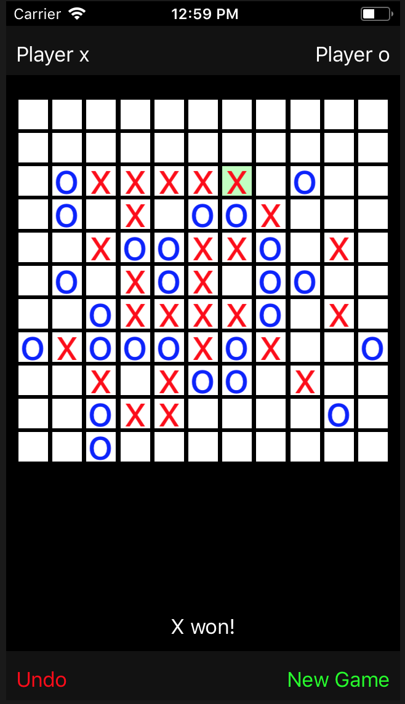

# Luffarschack

This is my hobby project, an iPhone app for playing 5-in-a-row (in Swedish called Luffarschack).  

I wrote algorithm of my own for ranking different moves based on how many you will get in a row and in how many ways you will do so. This can be found in RankedBoard.
I used it to create my basic bot, MediumBot, located in Bots.
Then I used Alpha-Beta-pruning to explore future moves in the game. 
